# TyphoonSearchSys

#历史台风相似路径查询系统

## 项目描述

本项目为历史台风及风暴潮查询显示系统  
主要参与人员：
[evaseemefly](https://github.com/evaseemefly)
[stupidanimal](https://github.com/stupidanimal)

---

## 项目主要构成目录

前后端的相关描述请详见`webclient`与 `webserver` 目录下的 readme 文件
[前端 readme](/webclient/README.md) 较详细
进度及问题：
[进度](/webclient/document/SCHEDULE.md)
[相关问题收集](/webclient/document/ISSUE.md)
[规约](/PROMISE.md)

[部分自己总结的知识点请见](https://github.com/evaseemefly/CodingBook/blob/417c6fb1860c6b5fd77e8a77da1c45d44f3793da/README.md) 以后均汇总至此

---

### 项目界面大致如下：

- v0.5 版本

1. 范围搜索，根据点选的位置，以及框选圆的半径获取该范围内的台风列表
   
2. 根据复杂查询条件获取匹配条件的台风列表
   
3. 根据复杂查询条件获取匹配后的台风列表，点选台风列表后可以加载台风的历史轨迹的时间列表，点选后加载该时刻全部测站的数据
   

4. 如表移入台风中心位置后加载该时刻的台风的气象数据
   

5. 点击指定时刻的台风加载指定时刻对应的测站数据
   

6. 历史潮位数据查询页面
   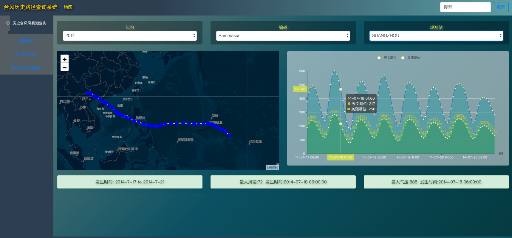

---

- v 1.0 版本

1. 地图页面加入了台风详情信息框（配色需再与当前配色统一）
   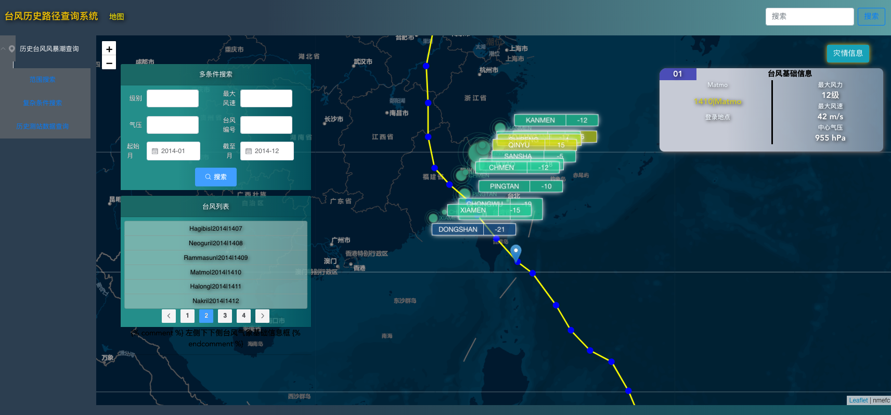

2. 点击测站加载整个过程的三条曲线以及极值（现只获取过程中增水最大值及对应的时刻）  
   by _19-06-27_
   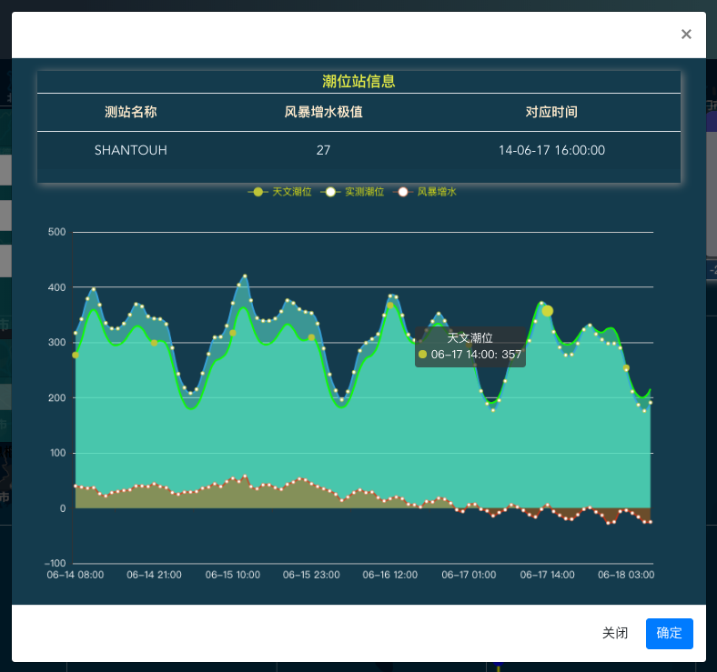

3. 缩小到一定级别（6 级）后测站的风暴增水只显示数值  
    by _19-06-27_
   缩放前：
   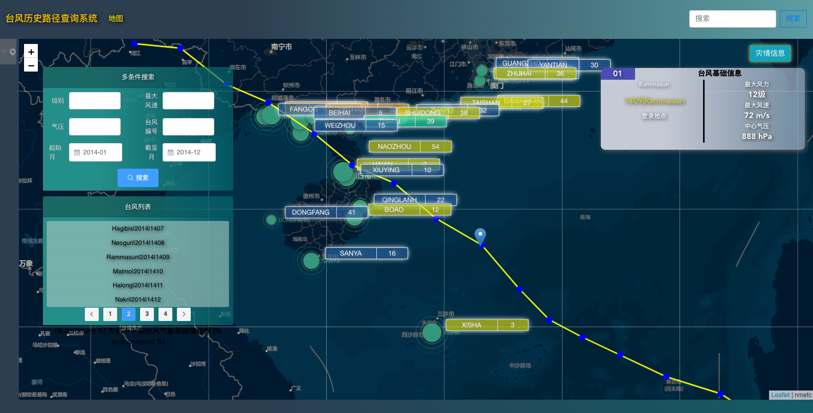
   缩放后：
   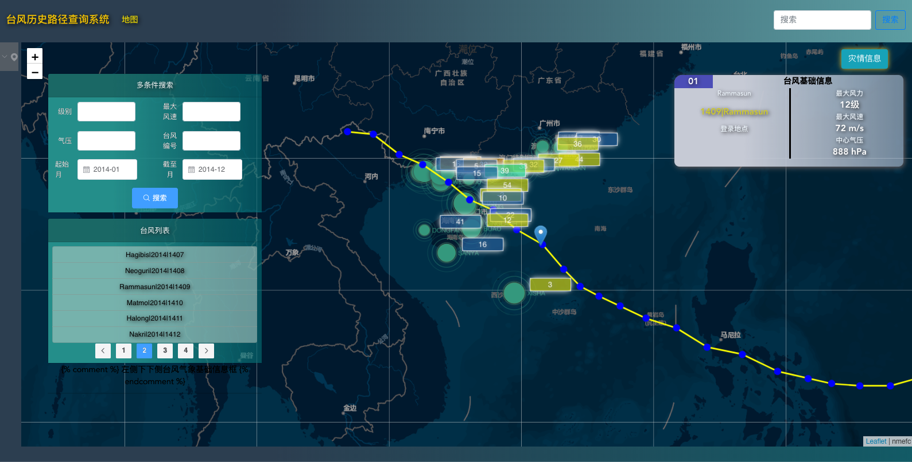

4. 点击台风后加载该过程共影响的测站数量
   by _19-06-29_
   不同数量的颜色略有不同
   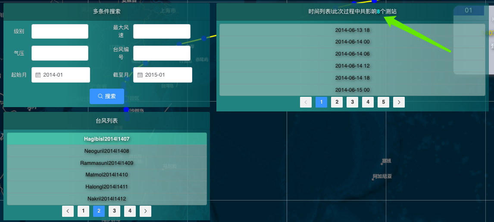
   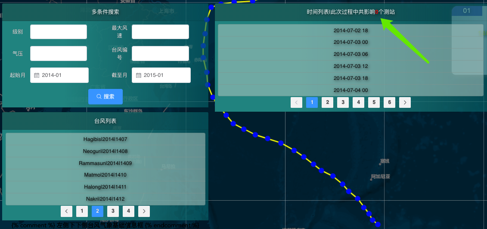
   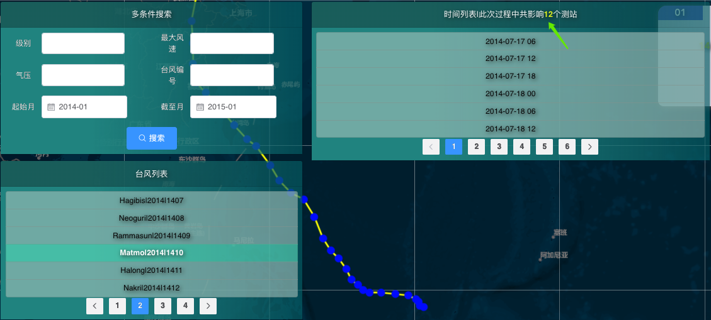

5) 级别改为下拉菜单，对应为 1-6 级（val 对应也是 1-6），并加上对应的风速范围（热带低压->强台风）
   by _19-06-30_
   效果如下：  
   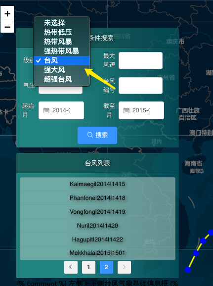

6. 点击台风后加载的灾情图片
   by _19-07-03_
   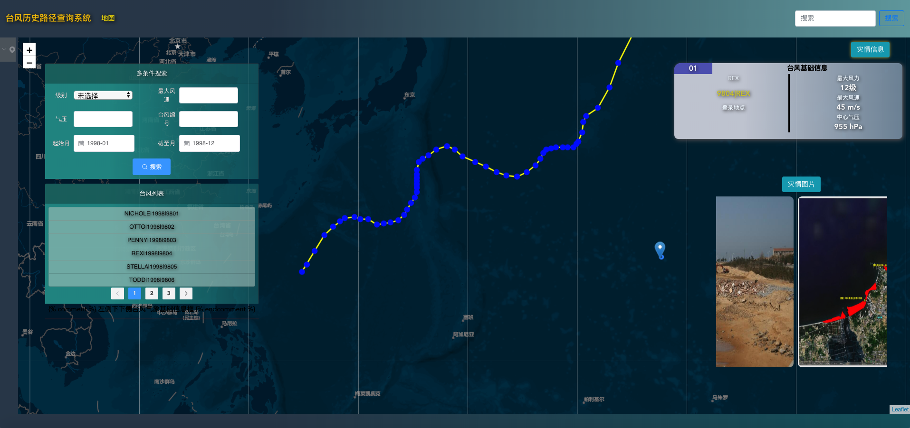
   收起的效果
   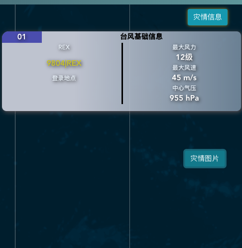
   展开的效果
   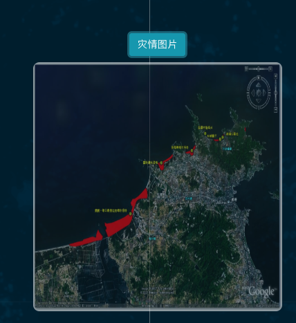

7. 录入全部测站数据后的效果
   by _19-07-11_
   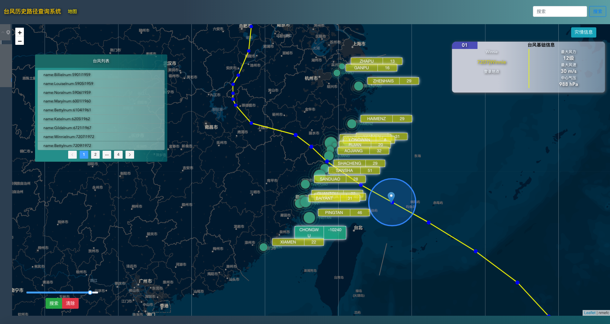
   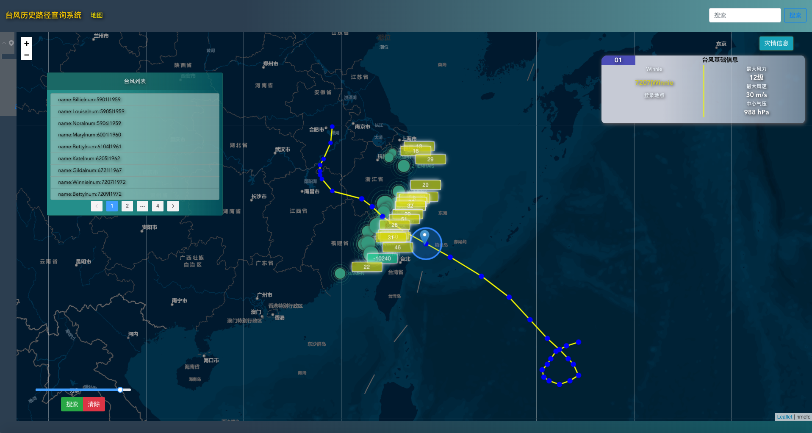
