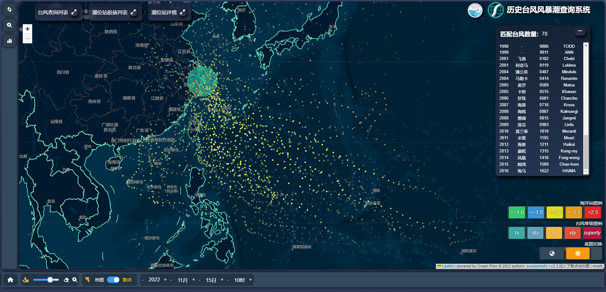

# TyphoonSearchSys

#历史台风相似路径查询系统

## 项目描述

本项目为历史台风及风暴潮查询显示系统  
主要参与人员：
[evaseemefly](https://github.com/evaseemefly)
[stupidanimal](https://github.com/stupidanimal)

---

## 项目主要构成目录

前后端的相关描述请详见`webclient`与 `webserver` 目录下的 readme 文件
[前端 readme](/webclient/README.md) 较详细
进度及问题：
[进度](/webclient/document/SCHEDULE.md)
[相关问题收集](/webclient/document/ISSUE.md)
[规约](/PROMISE.md)
- 22-11-04 新加入的工程化文档  
  - [工程化](/ENGINEERING.md)--具体记录详见(onenote-6-服务器部署)

[部分自己总结的知识点请见](https://github.com/evaseemefly/CodingBook/blob/417c6fb1860c6b5fd77e8a77da1c45d44f3793da/README.md) 以后均汇总至此

---
* @copyright: nmefc & [evaseemefly](https://github.com/evaseemefly)  
* 若有引用请写明出处

---

### 项目界面大致如下：

- v0.5 版本

1. 范围搜索，根据点选的位置，以及框选圆的半径获取该范围内的台风列表
   
2. 根据复杂查询条件获取匹配条件的台风列表
   
3. 根据复杂查询条件获取匹配后的台风列表，点选台风列表后可以加载台风的历史轨迹的时间列表，点选后加载该时刻全部测站的数据
   

4. 如表移入台风中心位置后加载该时刻的台风的气象数据
   

5. 点击指定时刻的台风加载指定时刻对应的测站数据
   

6. 历史潮位数据查询页面
   

---

- v 1.0 版本

1. 地图页面加入了台风详情信息框（配色需再与当前配色统一）
   

2. 点击测站加载整个过程的三条曲线以及极值（现只获取过程中增水最大值及对应的时刻）  
   by _19-06-27_
   

3. 缩小到一定级别（6 级）后测站的风暴增水只显示数值  
    by _19-06-27_
   缩放前：
   
   缩放后：
   

4. 点击台风后加载该过程共影响的测站数量
   by _19-06-29_
   不同数量的颜色略有不同
   
   
   

5) 级别改为下拉菜单，对应为 1-6 级（val 对应也是 1-6），并加上对应的风速范围（热带低压->强台风）
   by _19-06-30_
   效果如下：  
   

6. 点击台风后加载的灾情图片
   by _19-07-03_
   
   收起的效果
   
   展开的效果
   

7. 录入全部测站数据后的效果
   by _19-07-11_
   
   

----
22-10-14 日起开始重构此项目
#### 22-10-25
1- 重构了页面布局;   
2- 台风路径加入了线性过度以及对应的台风icon;  
3- 底部`btn-bar`加入了重新设计后的`时间组件`,当前时间组件步长:1h,加入了对当前时刻的对应位置示意的线性插值功能;  
4- 台风列表进行了重构，见右侧

#### 22-10-26
1- 加入了海洋站风暴增水组件(tideChartsFormView + stationTideForm);  
2- 以及对应的全部逻辑;  
3- 对于增水form与tySearch form 均加入了拖拽功能.  

#### 22-10-27 
1- 地图修改为浅色底图(个人更倾向于深色);  
2- 增水曲线加入了`天文潮` `风暴增水`与`实况` 以及对应样式,加入了对于缺省值的NaN过滤处理.  

####  22-10-28  
1- 对于地图中显示的站点加入了逐时的增水surge值显示,并加入了对应的四色警戒

2- 加入了根据当前台风`tyNum`获取该过程的所有站点的极值情况集合

#### 22-11-01  
1- 加入了隐藏的关联操作  
  
2- 极值显示列表中加入了对应的四色  

#### 22-11-07
1- 加入了图例
  
2- 完成了极值列表与对应预报时刻台风所在位置与站点的联动
3- 实现了三个缩略按钮的对应逻辑

#### 22-11-09  
1- 加入了站点名称中英文的映射关系  
2- 修复了由于 `stationName` 与 `stationCode` 混用导致的部分bug
3- 修复了由于缺少过程某个站而导致无法加载 极值集合列表组件 与 站点分布无法加载 的bug
4- 修复了 tideChart 组件中的一些bug并加入了x轴的 format 

#### 22-11-11  
1- 在各个子form中加入了最小化按钮，取消了缩略按钮中的最小化按钮，修改了对应的逻辑
* 在查询集合组件中加入了最小化按钮

* 在详情中加入了最小化按钮

* 在缩略组件中取消了最小化按钮

#### 22-11-14  
1- 加入了根据圈选范围加载途经的所有台风的分布散点|热图;  
* 散点

* 热图

* 加载热图及选定台风
  
2- 底部操作栏中加入了切换按钮  
逻辑:  
* 点击展开并默认加载热图
* 切换散点加载散点  
  
3- 部分按钮加入了描述信息

#### 22-11-15  
1- 加入了按照中心气压强度(转换为对应台风登记)在`circle`与`heatmap`中加入了权重因子
* 效果如下:
  circle
   
  热图
  

  #### 2-11-22 
  实现了按照年份及全部年份的指定月份的全部台风轨迹: 
  * 条件查询页面
   
  1- 加入了加载不同年份的台风轨迹，可以显示年际变化
  * 2014年
     
  * 2015年
     
  * 2016年
     
    2- 加入了加载1949-2018年的所有指定月份的台风轨迹，可以显示月际变化
  * 6月份
     
  * 7月份
     
  * 8月份
       

#### 2022-11-24 
加入按照唯一条件查询后的筛选台风加载散点或热图的功能，过滤台风列表按照时间倒序同一年按照台风编号升序，修复了部分bug.
* 指定月份的热图

* 过滤台风列表加入了排序

#### 22-11-29
将根据 复杂条件查询(uniquefilter) 与 范围条件查询(rangefilter) 提取为 `factoryLoadTy4Scatters` 方法 ，弃用 `loadFilter4Scatters`   
* `subNav` 组件 与 `map` 之间的联动

#### 22-11-30
最终取消监听`get2FilterTy4Scatters`而触发`factoryLoadTy4Scatters`;  
改为由事件总线触发`busToFilterTyPathList`加载过滤后的台风路径集合

修改后逻辑为:

#### 22-12-06  
由于增水极值与实际潮位极值有可能不出现在同一时刻，加入了潮位实况极值的功能。

根据`tynum`获取对应的海洋站潮位实况极值集合
站点显示潮位实况 与 对应的四色警戒潮位 以及对应的颜色并以柱状图的形势显示潮位值

#### 22-12-07  
由于总潮位存在基面不同需要统一并换算的问题，将 `增水极值集合` 修改为柱状图形式;将`站点总潮位极值集合`修改为颜色非柱状图的形式
  

#### 22-12-08  
1- 修改了柱状图的样式，去掉了 layoutView 的部分逻辑
  
2- 站点总潮位极值集合也加入了点击加载对应站点以及加载台风对应时刻的逻辑,统一了main与sub menu 的样式，修复了部分样式的bug

#### 22-12-09 
1- 站点潮位chart加入了增水极值与实况极值的标识

不使用与x轴垂直虚线的显示方式

#### v2.6总体效果
  