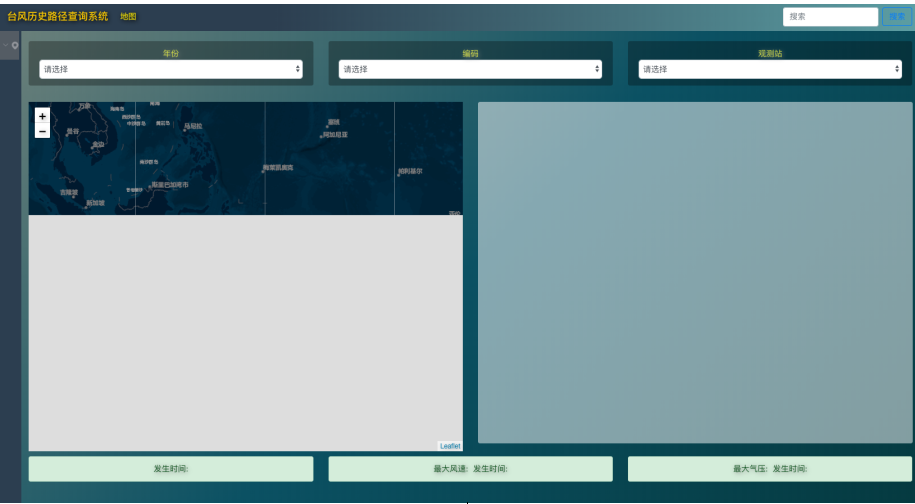

项目中出现的问题以后收集于此

## 1 动态计算 echarts 的高度，导致兄弟组件 100%自适应高度出问题

如图所示，本页面大概的加载顺序为，中间的部分  

| form_static_detail | |
|----------|:-------------:|
| map_single | typhoon_detail_charts |  

由于右侧的`typhoon_detail_charts`的高度是动态计算得来的
_在页面加载之后动态计算调整其高度_

```js
 mounted() {
    this.chartEle = document.getElementById("dataChart");
    this.setHeight();
    this.chart = echarts.init(this.chartEle);
  },

  setHeight() {
      //动态设定chart's constainer高度,.65系数看着给的没那么精细，毕竟两个row的高度没那么好算，写死也听傻的还不如就这样，而且硬设高度alert设定的是文字，不是内容也不太好算
      let body = document.body;
      let height = body.clientHeight;
      this.chartEle.style.height = Math.ceil(height * 0.65) + "px";
      // TODO:[-] 19-07-04 注意此处修改了echart的高度之后需要通知左边的 map 组件可以加载了！
      this.$store.state.chart.isStaticEchartsShow = true;
    }
```

根据 vue 的生命周期，`mounted`是在模板中的 html 已经渲染到外侧的 html 中后才执行（dom 也已经生成了）。而右侧的`map_single`组件的外侧 div 高度设置为 100%。所以`map_single`的高度是根据左侧的高度来决定的。
所以此处需要在左侧组件中要做的操作是：

- 1 右侧组件在页面加载后调整 echarts 的高度
- 2 修改 vuex 中的某一个标记(`chart.isStaticEchartsShow`)

右侧组件中执行完后，在左侧的子组件(`map_single`)中，需要监听 vuex 中的标记（chart.isStaticEchartsShow），渲染并显示页面（使用 v-if）

- 3 监听标记(`chart.isStaticEchartsShow`)

```js
 isShow: boolean = false;

 get isStaticEchartsShow(): boolean {
    return this.$store.state.chart.isStaticEchartsShow;
  }

  @Watch("isStaticEchartsShow")
  onIsStaticEchartsShow(val: boolean) {
    this.isShow = val;
  }
```

- 4 渲染页面

```html
<div v-if="isShow" id="singlecontent">
  ...
</div>
```
  

注意此处需要使用`v-if` 而不是`v-show`
[`v-if` 指令用于条件性地渲染一块内容。这块内容只会在指令的表达式返回 truthy 值的时候被渲染。](https://cn.vuejs.org/v2/guide/conditional.html)  
而`v-show`[v-show 是在任何条件下（首次条件是否为真）都被编译，然后被缓存，而且 DOM 元素保留(不管值为 true 还是 false，html 元素都会存在，只是 CSS 中的 display 显示或隐藏)。](https://zhuanlan.zhihu.com/p/38179618)  


此处由引出一个问题就是页面的顺序加载
对于时间上的顺序加载，可以通过上面说的`v-if`与`v-show`。即1组件加载之后，再加载2组件。